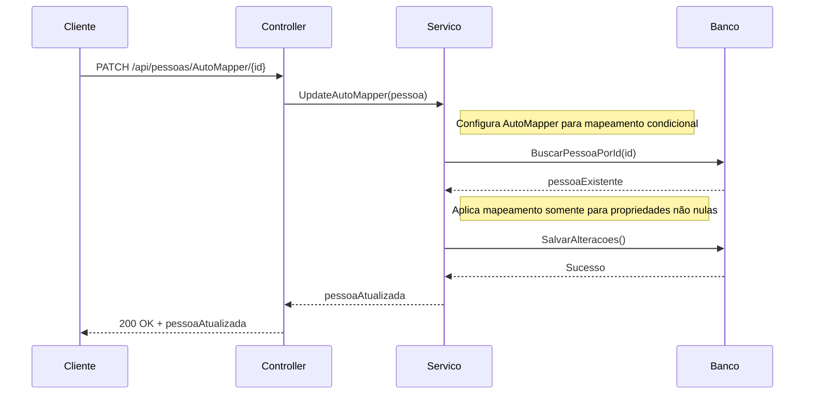

Projeto de exemplo para o artigo:

[**Criando métodos HTTP PATCH, usando o AutoMappe**r](https://dev.to/silvairsoares/criando-metodos-http-patch-usando-o-automapper-168g "Criando métodos HTTP PATCH, usando o AutoMapper")

